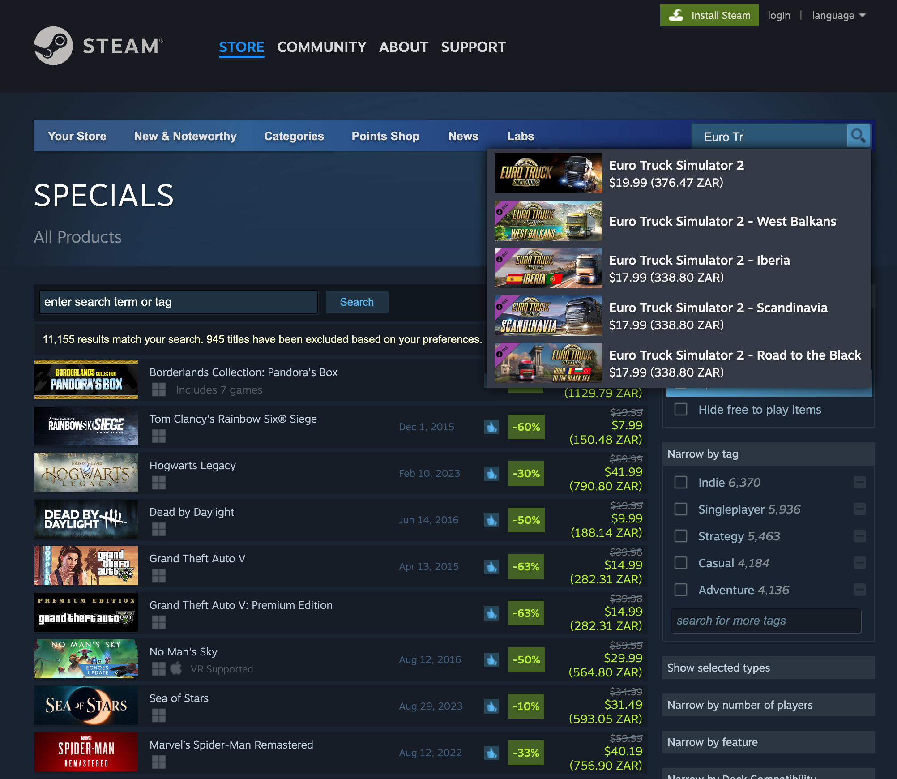
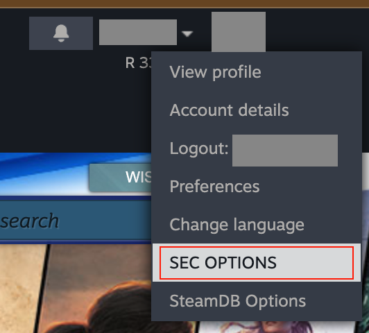
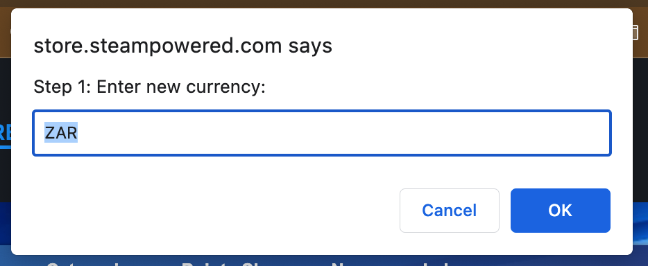
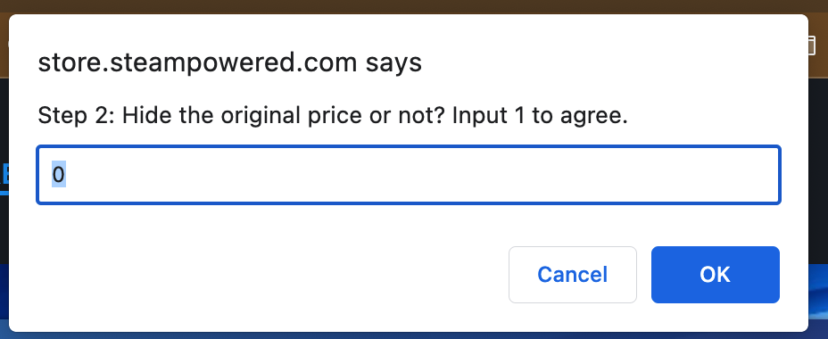

# Steam Easy Currency (SEC)
**Disclaimer: This script is not affiliated with Value Inc. or Steam.**
**Disclaimer: This script will not help you transfer your account to other countries or regions, as it is highly violating the Steam EULA.**

A script to help you display another currency of the store page for comparison.

## Usage
1. Download the script from [Greasy Fork](https://greasyfork.org/zh-TW/scripts/474486-steam-easy-currency).
2. Open Steam Store
3. Done!

## Examples

## Settings
You can set the display currency by clicking the panel on the top right.

Set your currency and whether keep the original price or not.

Avaliable currency is AE# Steam Easy Currency (SEC)
**Disclaimer: This script is not affiliated with Value Inc. or Steam.**
**Disclaimer: This script will not help you transfer your account to other countries or regions, as it is highly violating the Steam EULA.**

A script to help you display another currency on the store page for comparison.

## Usage
1. Download the script from Greasy Fork.
2. Open Steam Store
3. Done!

## Examples

## Settings
You can set the display currency by clicking the panel on the top right.

Set your currency and whether to keep the original price or not.

Avaliable currency is AED, AFN, ALL, AMD, ANG, AOA, ARS, AUD, AWG, AZN, BAM, BBD, BDT, BGN, BHD, BIF, BMD, BND, BOB, BRL, BSD, BTC, BTN, BWP, BYN, BZD, CAD, CDF, CHF, CLF, CLP, CNH, CNY, COP, CRC, CUC, CUP, CVE, CZK, DJF, DKK, DOP, DZD, EGP, ERN, ETB, EUR, FJD, FKP, GBP, GEL, GGP, GHS, GIP, GMD, GNF, GTQ, GYD, HKD, HNL, HRK, HTG, HUF, IDR, ILS, IMP, INR, IQD, IRR, ISK, JEP, JMD, JOD, JPY, KES, KGS, KHR, KMF, KPW, KRW, KWD, KYD, KZT, LAK, LBP, LKR, LRD, LSL, LYD, MAD, MDL, MGA, MKD, MMK, MNT, MOP, MRU, MUR, MVR, MWK, MXN, MYR, MZN, NAD, NGN, NIO, NOK, NPR, NZD, OMR, PAB, PEN, PGK, PHP, PKR, PLN, PYG, QAR, RON, RSD, RUB, RWF, SAR, SBD, SCR, SDG, SEK, SGD, SHP, SLL, SOS, SRD, SSP, STD, STN, SVC, SYP, SZL, THB, TJS, TMT, TND, TOP, TRY, TTD, TWD, TZS, UAH, UGX, USD, UYU, UZS, VES, VND, VUV, WST, XAF, XAG, XAU, XCD, XDR, XOF, XPD, XPF, XPT, YER, ZAR, ZMW, ZWL.

## Bugs, issues and suggestions
Feel free to pull requests, and open issues!

## Special Thanks
- [jQuery](https://jquery.com/)
- [Exchangerate.host](https://exchangerate.host/#/)D, AFN, ALL, AMD, ANG, AOA, ARS, AUD, AWG, AZN, BAM, BBD, BDT, BGN, BHD, BIF, BMD, BND, BOB, BRL, BSD, BTC, BTN, BWP, BYN, BZD, CAD, CDF, CHF, CLF, CLP, CNH, CNY, COP, CRC, CUC, CUP, CVE, CZK, DJF, DKK, DOP, DZD, EGP, ERN, ETB, EUR, FJD, FKP, GBP, GEL, GGP, GHS, GIP, GMD, GNF, GTQ, GYD, HKD, HNL, HRK, HTG, HUF, IDR, ILS, IMP, INR, IQD, IRR, ISK, JEP, JMD, JOD, JPY, KES, KGS, KHR, KMF, KPW, KRW, KWD, KYD, KZT, LAK, LBP, LKR, LRD, LSL, LYD, MAD, MDL, MGA, MKD, MMK, MNT, MOP, MRU, MUR, MVR, MWK, MXN, MYR, MZN, NAD, NGN, NIO, NOK, NPR, NZD, OMR, PAB, PEN, PGK, PHP, PKR, PLN, PYG, QAR, RON, RSD, RUB, RWF, SAR, SBD, SCR, SDG, SEK, SGD, SHP, SLL, SOS, SRD, SSP, STD, STN, SVC, SYP, SZL, THB, TJS, TMT, TND, TOP, TRY, TTD, TWD, TZS, UAH, UGX, USD, UYU, UZS, VES, VND, VUV, WST, XAF, XAG, XAU, XCD, XDR, XOF, XPD, XPF, XPT, YER, ZAR, ZMW, ZWL.

## Bugs, issues and suggestions
Feel free to pull requests, and open issues!

## Special Thanks
- [jQuery](https://jquery.com/)
- [Exchangerate.host](https://exchangerate.host/#/)